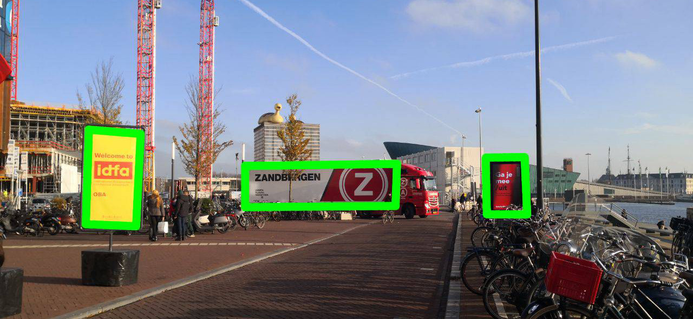

# Product placement in the video streams
#AndroidDevChallenge
## Tell us what your idea is.

Don't you find the video advertisement annoying? How many times does it appear during the video? More and more people installing ad blocker software as an extension to their browsers that has an impact on publisher profit.  On the other hand, advertising is a significant source of revenue. As a result, the authors of videos are forced to integrate advertisements directly to the clip. Unfortunately, this is not a good solution, because users are getting more irritated or just fast forward the video. How to make advertisement user-friendly and unobtrusive? We believe that the key to solving this problem is lying in technologies that provided integration commercial content directly into videos without interrupting the viewer experience. The video will run smoothly without any interceptions and all ads blocks will be injected dynamically, also content might also target - most relevant content for users.

Our team is going to create a video streaming application, where input video stream will be parsed on the application side for injecting commercial contentment dynamically. With this implementation, when the video stream is processing on a client-side in real-time, there is no need to allocate resources for video stream preparation on video stream provider web resource. This saves the cost of web service maintaining. Because of no need additional processing time for preparing video stream with pre-rendered frames and also no need additional space (the is only one single copy of original video). 

There is below our vision of the algorithm:

1. Initial video frame.

2. Feature-based object detection in action.  There 3 candidates as a container for advertisement.

3. Banner’s content is substituted.

## Tell us how you plan on bringing it to life. 

The idea is making an application that can automatically detect and mark places where the banner can be injected, replaced or overdrawn in runtime. It could be anywhere: stickers, posters on the walls, inscriptions on a cup of coffee, labels on the jackets, etc. Relying on detected areas a tool displays above them own advertisement banner from preloaded from backend commercial data sets.

For this purpose we are going to make not just a feature-based object detection model, which is able to detect areas like stickers or posters which could be replaced by proper commercial content, but a model which could also use addition features like an angle, lighting, colors, e.t.c for making predictions, how good or bad some area on a scene as a potential commercial content area. That’s why deep learning using TensorFlow is the best solution in this case. The output model should consist of two sublayers. The first one, representing the feature-detection algorithm based on the convolutional neural network will be used for detecting content areas, and the second one will be used for making a prediction of how good or bad this region. The final stage of the project is using TensorFlow Converter for making TensorFlow Lite file which will be built-in into the Android app. We believe that the existing CPU resources on the client side could be successfully used for real-time commercial contentment integration so additional video preparation will not need on the provider side in this case. 

## Tell us about you.

In the middle of 2019, we have organized the team whose main purpose is making experiments in the intersection between Machine learning technologies and some of the use cases from real life. We are focusing on making simple software prototypes, which could show people how some of their everyday activities could be improved by using modern Artificial intelligent technologies that people could play with them a bit. The main idea is finding new ways of how Artificial intelligence could help people make their lives better. 

For now, our small team consists only of two people:

[Anton Valiukh](https://ua.linkedin.com/in/valiuh) and [Artem Garkusha](https://nl.linkedin.com/in/artemgarkusha)

But that fact, that we have a vision, that Artificial Intelligence and Machine learning could not just cover some business use cases, but also make the world a better way, give us confidence that we will be grooving in the future by finding new people who will join our team. 

